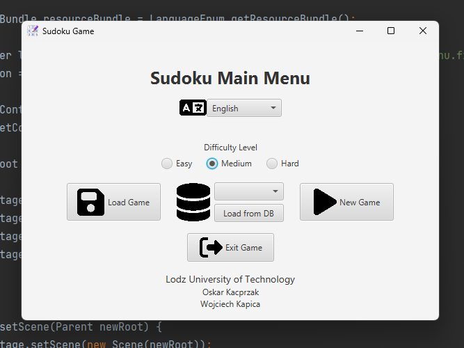
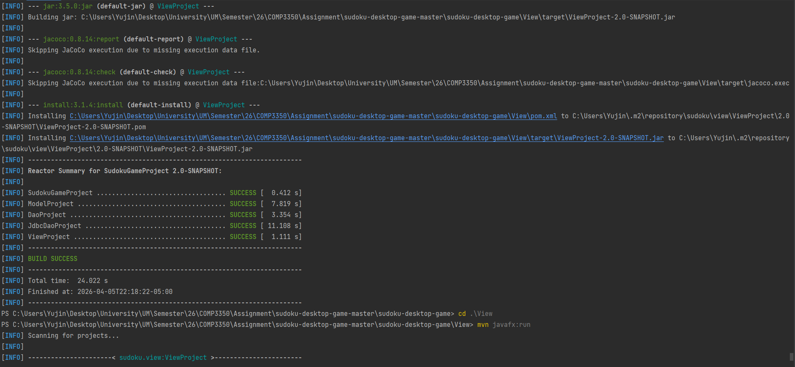

# 1. Getting the System Running

### Environment

The system was set up and executed in the following environment:

- Operating System: Windows 10
- IDE: IntelliJ IDEA
- Java Version: JDK 21
- Build Tool: Maven 3.9+
- UI Framework: JavaFX 22


### Steps Taken to Run the System
To run the system locally, I followed the instructions provided in the repository

1. Cloned the repository:
   ```
   git clone https://github.com/Oskarowski/sudoku-desktop-game.git
   cd sudoku-desktop-game
   ```
2. Built the project using Maven: ``` mvn install ```
3. Ran the application: ``` mvn javafx:run -pl View ```

### Challenges and Issues Encountered
Although the steps appeared straightforward, getting the system to run required significant trial and error.
- **Java version mismatch issues**  
The project required Java 21+, but the system was not initially configured correctly. This caused Maven build errors. I had to explicitly verify and switch the JDK version used by both the system and the IDE.


- **JavaFX configuration complexity**  
Since JavaFX is not bundled with newer Java versions, it was not immediately clear whether additional setup was required. Running the project through Maven helped resolve this, but understanding why it worked required inspecting the project configuration.


- **Multi-module project confusion**  
The repository is structured into multiple modules (e.g., Dao, Model, View). Initially, it was unclear where the entry point of the application was. Running the project without specifying the correct module failed.
I eventually identified that the application must be run from the View module using: ```mvn javafx:run -pl View```


- **Dependency resolution and build issues**    
  The project depends on several libraries (JOOQ, SQLite, SLF4J, Logback). While Maven manages these automatically, initial builds failed until all dependencies were fully resolved via ```mvn install```.


- **Lack of clear entry point documentation**    
  There was no explicit explanation of where the main class was located, which required manually exploring the project structure to understand how the application starts.     


### How Issues Were Diagnosed and Resolved
To resolve these issues, I used a combination of:
- Reading Maven error logs carefully to identify configuration problems
- Verifying Java version settings both in the terminal and IDE
- Exploring the project directory structure to understand module relationships
- Running different Maven commands and adjusting parameters (trial-and-error)
- Identifying the correct execution module (View) by inspecting where UI-related code exists

### Overall Approach and Reflection
My approach to getting the system running was not linear. Instead, it involved iterative experimentation and investigation.    

Initially, I expected the setup process to be straightforward based on the provided instructions. However, due to the multi-module structure and external dependencies, the process required deeper inspection of the build system and project organization.   

Through this process, I learned that:

- Running a legacy system often requires understanding the build configuration, not just following instructions
- Maven plays a critical role in managing dependencies and execution, especially in multi-module projects
- Identifying the correct entry point is essential and may require manual exploration when documentation is limited

Overall, the setup process provided valuable insight into how the system is structured and how its components interact, which was helpful for understanding the codebase in later stages.

### Evidence
<table>
  <tr>
    <td></td>
    <td></td>
  </tr>

  <tr>
    <td align="center">App running</td>
    <td align="center">Build Successfully</td>
  </tr>
</table>

# 2. Understanding the System

### What the Project Does
This project is a desktop-based Sudoku game application. It allows users to play Sudoku puzzles through a graphical user interface, where they can interact with a grid, input numbers, and attempt to solve the puzzle.

The application provides a structured environment for playing Sudoku rather than solving it manually, managing both the game state and user interactions.


### What Problem It Solves

The system solves the problem of managing a Sudoku game digitally. Instead of using paper, the application:

- Maintains the state of the puzzle (user inputs, correct/incorrect values)
- Provides a consistent interface for interacting with the board
- Stores Sudoku boards using a database (SQLite), allowing persistence

This reduces the complexity of tracking progress manually and ensures that the game logic is handled correctly by the system.


### Major Features

From exploring the system and running the application, the major features include:

- **Sudoku Board Display**   
A 9x9 grid where users can view and interact with the puzzle.
- **User Input Handling**   
Users can input numbers into cells to attempt solving the puzzle.
- **Game State Management**   
The system tracks the current state of the board, including which values have been entered.
- **Persistence (Database Integration)**  
Sudoku boards are stored using SQLite, allowing data to be retrieved and reused.
- **Validation Logic (Implicit)**  
The system likely includes logic to validate moves or maintain constraints of Sudoku (based on the presence of model and DAO layers).


### How a User Interacts with the System

A typical user interaction flow is as follows:

1. The user launches the application, which opens the Sudoku interface.
2. A Sudoku board is displayed on the screen.
3. The user interacts with the grid by selecting cells and entering numbers.
4. The system updates the board state in response to user input.
5. The user continues filling in values until the puzzle is complete.

The interaction is entirely GUI-based, meaning users do not need to interact with any underlying code or commands.


### Understanding from Code Structure

Based on the project structure (e.g., View, Model, Dao), the system appears to separate responsibilities:

- The View layer handles the user interface and user interactions
- The Model layer represents the Sudoku board and game state
- The DAO layer is responsible for database interactions (e.g., storing and retrieving boards)

This indicates that the application is not just a simple UI program, but a structured system with separation of concerns.

### Summary

In summary, this project is a GUI-based Sudoku application that allows users to interactively solve puzzles while the system manages game logic and persistence. The system combines user interface components, game state management, and database storage to provide a complete playable experience.

### Name-in-UI requirement:
<table>
  <tr>
    <td></td>
  </tr>
</table>


# 3. Architecture Exploration and Reflection

### Architecture Style
From analyzing the project structure, the system follows a layered architecture with MVC-like characteristics.

- The View layer (```View``` package) handles the graphical user interface and user interactions
- The Model layer (```Model``` package) represents the Sudoku board and game logic
- The Data Access layer (```Dao```, ```JdbcDao``` packages) handles persistence and database operations

While the project is not a strict MVC implementation, it clearly separates concerns between UI, business logic, and data access, which is consistent with a layered design.


### How Responsibilities Are Divided Across Packages and Classes
Responsibilities are divided reasonably clearly across the codebase.

1. **View layer**

    The ```View``` module is responsible for GUI setup, scene switching, event handling, and connecting UI controls to the underlying Sudoku logic.

    Examples:

    - ```View/src/main/java/sudoku/view/App.java```  
    Starts the JavaFX application, loads ```MainMenu.fxml```, and sets the initial stage title and scene.
    - ```View/src/main/java/sudoku/view/MainMenuController.java```  
    Handles difficulty selection, language changes, loading games from file/database, and transitioning to the gameplay scene.
    - ```View/src/main/java/sudoku/view/GameController.java```  
    Builds the Sudoku grid in JavaFX, connects each TextField to a SudokuField, handles save actions, and checks whether the game has ended.

    So the View layer is doing more than simple rendering: it also contains a lot of interaction and coordination logic.

2. **Model layer**

    The Model module contains the core Sudoku representation and rules.

    Examples:

    - ```Model/src/main/java/sudoku/model/models/SudokuBoard.java```  
    Represents the whole board, gives access to rows/columns/boxes, validates the board, checks end-game state, and uses a solver.
    - ```Model/src/main/java/sudoku/model/models/SudokuField.java```  
    Represents a single cell and stores its value.
    - ```SudokuRow.java```, ```SudokuColumn.java```, ```SudokuBox.java```  
    Represent board substructures used for Sudoku validation.
    - ```BacktrackingSudokuSolver.java```  
    Solves the board and is used when creating a new game.

The Model layer therefore contains the real game state and the rules that define whether the Sudoku board is valid.

3. **Persistence layer**  

    Persistence is split into two parts:
    - ```Dao``` contains abstractions/factory logic
    - ```JdbcDao``` contains the database-specific implementation

Examples:

- ```Dao/src/main/java/sudoku/dao/factories/SudokuBoardDaoFactory.java```  
Creates either a file-based DAO or a JDBC-based DAO.
- ```Dao/src/main/java/sudoku/dao/models/FileSudokuBoardDao.java```  
Handles file persistence.
- ```JdbcDao/src/main/java/sudoku/jdbcdao/JdbcSudokuBoardDao.java```  
Handles SQLite persistence using JOOQ.

This separation is useful because it distinguishes general persistence intent from concrete database implementation.

### Is There Separation Between UI and Logic?

There is some separation between UI and logic, but it is only partial.

At a package level, the project clearly separates UI classes into **View** and domain classes into **Model**. That is a positive architectural choice. However, at the class level, the separation is not very strong because the UI directly manipulates domain objects.

A clear example appears in:
- ```View/src/main/java/sudoku/view/GameController.java```
- ```Model/src/main/java/sudoku/model/models/SudokuBoard.java```
- ```Model/src/main/java/sudoku/model/models/SudokuField.java```

In ```GameController.initialize()```, the controller creates a new ```SudokuBoard``` directly:  
```
sudokuBoard = new SudokuBoard(new BacktrackingSudokuSolver());
sudokuBoard.solveGame();
gameDifficulty.clearSudokuFieldsFromSudokuBoardBasedOnDifficulty(sudokuBoard);
```

Then, inside ```initSudokuBoardGridPane()```, the UI retrieves each field directly from the model:
```SudokuField sudokuField = sudokuBoard.getField(j, i);```

Then, inside ```createTextField(...)```, the UI updates the domain object directly when the user types:  
```
sudokuField.setValue(newValue.isEmpty() ? 0 : Integer.parseInt(newValue));
if (sudokuBoard.checkEndGame()) {
    endGame();
}
```

That call chain is:  
User clicks “load from DB” → ```MainMenuController.loadSavedSudokuGameFromDB()``` → ```SudokuBoardDaoFactory.createJdbcSudokuBoardDao(...)``` → ```JdbcSudokuBoardDao.read(...)``` → ```GameController``` receives loaded ```SudokuBoard```

So yes, there is package-level separation, but the View layer still directly coordinates model and persistence operations.


### Where Is Coupling High?
A major area of high coupling is between the View layer and the Model layer.  

**Example 1**: `GameController` ↔ `SudokuBoard` / `SudokuField`

File evidence:

- `View/src/main/java/sudoku/view/GameController.java`
- `Model/src/main/java/sudoku/model/models/SudokuBoard.java`
- `Model/src/main/java/sudoku/model/models/SudokuField.java`

`GameController` depends directly on:
- `SudokuBoard`
- `SudokuField`
- `BacktrackingSudokuSolver`

This means the controller knows:
- how the board is created
- how the solver is attached
- how fields are accessed
- how field values are updated
- how end-game is checked

That is strong coupling because if the internal model design changes, the controller will likely need changes too. For example, if board access changed from `getField(x, y)` to another representation, or if field updates required validation through a service object, `GameController` would have to be rewritten.


**Example 2**: `MainMenuController` ↔ persistence layer

File evidence:
- `View/src/main/java/sudoku/view/MainMenuController.java`
- `Dao/src/main/java/sudoku/dao/factories/SudokuBoardDaoFactory.java`
- `JdbcDao/src/main/java/sudoku/jdbcdao/JdbcSudokuBoardDao.java`

`MainMenuController` directly creates DAOs using `SudokuBoardDaoFactory`, builds file/database paths, and handles loaded `SudokuBoard` objects itself.

It even contains database-path construction logic:
```
String jdbcDaoProjectPath = Paths.get("..", "JdbcDao", "sudoku.db").toString();
String databaseFilePath = Paths.get(jdbcDaoProjectPath).toAbsolutePath().toString();
```

This means UI code knows details about where the database file is located and how persistence is configured. That is a maintenance risk because storage configuration changes would affect the UI controller.

**Example 3: JDBC implementation tightly coupled to SQLite/JOOQ**

File evidence:
- `JdbcDao/src/main/java/sudoku/jdbcdao/JdbcSudokuBoardDao.java`

`JdbcSudokuBoardDao` is tightly coupled to:
- SQLite connection strings (`jdbc:sqlite:`)
- JOOQ-generated tables (`SUDOKU_BOARDS`, `SUDOKU_FIELDS`)
- SQL transaction behavior

For example:
```
connection = DriverManager.getConnection(url);
dsl = DSL.using(connection, SQLDialect.SQLITE);
```
and
```
dsl.insertInto(SUDOKU_BOARDS) ...
dsl.insertInto(SUDOKU_FIELDS) ...
```
This makes the persistence implementation very specific to its current technology stack. Replacing SQLite or JOOQ would require significant DAO changes.


### Where Is Cohesion Strong or Weak?
### Strong cohesion

A good example of strong cohesion is `SudokuBoard.java`.

File:
- `Model/src/main/java/sudoku/model/models/SudokuBoard.java`

This class is strongly cohesive because most of its methods are focused on one responsibility: representing and validating the board state.

Examples of related responsibilities inside `SudokuBoard`:

- `getField(int x, int y)`
- `setField(int x, int y, int value)`
- `isValidSudoku()`
- `checkEndGame()`
- `solveGame()`

These all relate directly to board state and board validity. Even though the class is not tiny, its methods mostly contribute to one central purpose.

Another reasonably cohesive part is `SudokuField.java`, which focuses on storing a single value and notifying listeners when that value changes.


### Weak cohesion

A weaker cohesion example is MainMenuController.java.

File:
- `View/src/main/java/sudoku/view/MainMenuController.java`

This class handles many different responsibilities:
- difficulty selection
- language selection
- scene switching
- loading from file
- loading from database
- database path setup
- author display

These responsibilities are all related to the main menu broadly, but they are still quite mixed. The class acts as:
- a UI event handler
- a navigation coordinator
- a persistence access point
- a configuration handler

That weakens cohesion because the class is doing too many kinds of work.

`GameController.java` also has mixed responsibilities. It:
- builds the grid UI
- creates a new board
- invokes the solver
- updates model objects from text input
- checks end game
- triggers save strategies

So while it is functional, it also shows weaker cohesion than an ideal controller would.


### Does the Architecture Make Maintenance Easier or Harder?

Overall, the architecture makes maintenance somewhat easier at a high level, but harder in detail when real changes are needed.

**What makes maintenance easier**  

**1. Clear package separation**  
The codebase is easier to read because UI, model, and persistence are placed in separate modules:
- `View`
- `Model`
- `Dao`
- `JdbcDao`


**2. Domain logic is not buried inside FXML files**  
Core Sudoku concepts such as board, row, column, box, and field are represented as separate classes in the Model layer.  

**3. Persistence is at least isolated into DAO-related modules**  
The existence of `SudokuBoardDaoFactory`, `FileSudokuBoardDao`, and `JdbcSudokuBoardDao` is better than placing raw SQL directly inside UI classes.

**What makes maintenance harder**  
**1. Controllers depend directly on too many layers**
MainMenuController talks directly to persistence logic, and GameController talks directly to domain logic.
  
**2. No service/application layer**  
There is no intermediate layer for actions like:
- creating a game
- loading a board
- updating a move
- validating completion

Because of this, UI controllers become the place where coordination logic accumulates.

**3. Concrete technology details leak upward**  
Database file paths and DAO creation logic appear in the UI controller. That means infrastructure changes can affect presentation code.  

**4. Changes may cascade**  
For example, if the representation of the board changes, `GameController` may need updates because it directly accesses fields with `getField(j, i)` and directly sets values through `SudokuField.setValue(...)`.

A concrete maintenance-risk call chain is:  

`MainMenuController.loadSavedSudokuGameFromDB()` → `SudokuBoardDaoFactory.createJdbcSudokuBoardDao(...)` → `JdbcSudokuBoardDao.read(...)` → `new GameController(..., sudokuBoard)`

If the persistence mechanism changes, this flow may break in the controller itself because there is no abstraction shielding the UI.

Similarly, another maintenance-risk flow is:

JavaFX `TextField` input → `GameController.createTextField()` listener → `SudokuField.setValue(...)` → `SudokuBoard.checkEndGame()`

If the model later requires stricter move validation, undo history, or immutable updates, the current direct manipulation style will be harder to adapt safely.

### Conclusion

The system shows a reasonable layered structure and is more organized than a completely tangled legacy application. The presence of separate `View`, `Model`, `Dao`, and `JdbcDao` modules helps make the system understandable and gives it some architectural discipline.

However, the separation is only partial. In practice, the controllers in the View layer are tightly coupled to both the domain model and persistence logic. `GameController` directly creates and manipulates `SudokuBoard` and `SudokuField` objects, while `MainMenuController` directly handles DAO creation and database-loading logic. This makes the system easier to understand initially, but harder to modify safely when requirements change.

So my overall assessment is that the architecture **helps with navigation and basic understanding**, but **its direct dependencies between layers make long-term maintenance harder than it needs to be.**

# 4. Testing and Build State

### Presence of tests
Tests are present in the repository. They are organized across multiple modules, primarily within the `Model`, `Dao`, and `JdbcDao` projects, each containing a `src/test/java/...` directory.

For example:
- Model/src/test/java/... contains:
  - `UniqueCheckerTest`
  - `SudokuBaseContainerTest`
  - `SudokuBoardTest`
  - `SudokuFieldTest`
- `Dao/src/test/java/...` contains:
  - `FileSudokuBoardDaoTest`
  - `SudokuBoardDaoFactoryTest`
- `JdbcDao/src/test/java/...` contains:
  - `JdbcSudokuBoardDaoTest`

The `View` module does not contain any test files, indicating that the UI layer is currently not covered by automated tests.


### Were the tests runnable?
Yes, the tests were runnable.

I executed the full test suite using: `mvn test`

All tests across the modules ran successfully with no failures or errors.

### Summary of results:
- **Model module**: 44 tests passed
- **Dao module**: 2 tests passed
- **JdbcDao module**: 5 tests passed
- **Total**: 51 tests passed, 0 failures, 0 errors

During execution, repeated log messages such as “Invalid Sudoku board after setting field value” appeared in `SudokuBoardTest`. However, these did not result in test failures and appear to be part of validation scenarios intentionally tested.


### Additional observation: running a single test
When attempting to run only my newly added test using:

`mvn -Dtest=SudokuFieldPropertyChangeTest test`

the build failed in the `Dao` module with the error: “No tests matching pattern were executed”  
This occurs because the project is a multi-module Maven build, and other modules (e.g., `Dao`) do not contain this specific test.  
To resolve this, I restricted execution to the Model module:

`mvn -pl Model -Dtest=SudokuFieldPropertyChangeTest test`

This successfully ran only the new test.  
This behavior highlights an important structural aspect of the system: tests are module-specific, and running targeted tests requires awareness of module boundaries.


### Coverage and what it implies
JaCoCo coverage reports were generated during the build process for each module. The number of tests suggests:
- Strong coverage in the Model layer (44 tests)
- Limited coverage in the Dao and JdbcDao layers
- No coverage in the View layer

This implies that:
- Core Sudoku logic is relatively well protected by tests
- Persistence and UI layers are more vulnerable to regression
- Coverage alone does not guarantee correctness, but it provides a useful indicator of testing focus


### Maintainability and risk
The presence of automated tests improves maintainability, especially in the model layer where correctness is critical.

However, there are risks:
- Lack of tests in the UI layer means user-facing bugs may go undetected
- Limited DAO/JDBC coverage increases risk when modifying persistence logic
- Multi-module structure makes targeted test execution slightly more complex

Overall, the system has a solid foundation for testing core logic, but uneven coverage introduces risk in other parts of the system.


### Required: Implement one automated test
### What I chose to test and why
I implemented a test for the `SudokuField` class, specifically verifying that changing the field’s value correctly triggers property change notifications.  
This behavior is important because other components, especially the UI, may rely on these notifications to update the display. If this mechanism breaks, the application could behave inconsistently even if the internal state is correct.


### Type of test
This is a unit test because:
- It tests a single class (`SudokuField`)
- It does not depend on external systems (e.g., database, file system, UI)
- It verifies behavior in isolation


### Test execution result
I executed the test independently using:  

`mvn -pl Model -Dtest=SudokuFieldPropertyChangeTest test`

The test ran successfully:
- Tests run: 2
- Failures: 0
- Errors: 0


### Refactoring required
No refactoring was required to enable this test.  
The SudokuField class already exposes methods such as:
- `addPropertyChangeListener(...)`
- `removePropertyChangeListener(...)`
- `setValue(...)`

This indicates that the class was already designed with testability in mind.


### Location of test file
The test file is located at:

`Model/src/test/java/models/SudokuFieldPropertyChangeTest.java`


### Final reflection
Overall, the project includes a functioning automated test suite with strong coverage in the model layer. However, the absence of tests in the UI layer and limited coverage in persistence layers suggest areas for improvement. While the existing tests provide confidence in core functionality, expanding test coverage would significantly improve the system’s maintainability and reliability.


# 5. Identifying a Maintenance Opportunity
### Selected Issue: Design Flaw – Tight Coupling Between Persistence and Domain Logic

### Description of the problem
A key design flaw in the system is the tight coupling between persistence logic (DAO/JDBC) and the domain model (SudokuBoard and related classes).  
Specifically, the persistence layer (e.g., `JdbcSudokuBoardDao`) directly interacts with domain objects such as `SudokuBoard` and `SudokuField`, and is responsible for translating database rows into domain objects and vice versa.

This creates a situation where:
- Changes in the domain model (e.g., adding fields or changing structure) will require modifications in DAO classes
- Persistence logic is aware of internal structure of domain objects
- There is no clear separation between data storage representation and business logic

This violates separation of concerns and makes the system harder to maintain and extend.


### Affected classes and modules
This issue primarily affects the following modules and classes:

**JdbcDao module:**
- JdbcSudokuBoardDao
- Generated classes under sudokujdbc.jooq.generated.*

**Dao module:**
- FileSudokuBoardDao
- SudokuBoardDaoFactory

**Model module:**
- SudokuBoard
- SudokuField
- SudokuBaseContainer

The dependency flow looks like: JdbcSudokuBoardDao → SudokuBoard → SudokuField  
This shows that the persistence layer depends directly on internal domain structures.


### Architectural risk
This design introduces several risks:

**1. High coupling**  
If the structure of `SudokuBoard` changes (e.g., adding metadata or changing field representation), all DAO implementations must be updated accordingly.

**2. Fragile persistence layer**  
Persistence logic relies on detailed knowledge of how the board is structured (rows, columns, values). Any change in representation may break save/load functionality.

**3. Difficult to extend**  
Adding a new persistence method (e.g., REST API, cloud storage) would require duplicating mapping logic across multiple classes.

**4. Testing complexity**  
Testing persistence requires constructing full domain objects, increasing test complexity. Changes in domain logic may indirectly break persistence tests.

**5. Risk of hidden bugs**  
Because there is no clear abstraction layer between storage and domain, inconsistencies between database representation and in-memory objects may occur.


### Proposed seam for safe modification
To reduce coupling and improve maintainability, I would introduce a mapping layer (seam) between the persistence layer and the domain model.

**Proposed solution: Introduce a Mapper (Adapter)**  
Create a new class, for example: SudokuBoardMapper

Responsibilities:
- Convert database records → domain objects
- Convert domain objects → database format


### New structure:
JdbcSudokuBoardDao → SudokuBoardMapper → SudokuBoard

Instead of: JdbcSudokuBoardDao → SudokuBoard (direct dependency)


### Benefits of introducing this seam
**1. Reduced coupling**  
DAO no longer depends directly on internal structure of domain objects.

**2. Improved maintainability**  
Changes in domain model only require updates in the mapper, not across all DAO classes.
 
**3. Easier testing**  
Mapper logic can be tested independently with unit tests.

**4. Better extensibility**  
New persistence mechanisms can reuse the same mapping logic.

**5. Safer refactoring**  
Domain and persistence layers can evolve independently with reduced risk.


### What needs protection via tests
If this change were implemented, the following should be protected with tests:
- Correct mapping between database records and SudokuBoard
- Preservation of board values across save/load operations
- Edge cases (empty board, partially filled board, invalid values)

Existing tests such as:
- `JdbcSudokuBoardDaoTest`
- `FileSudokuBoardDaoTest`
would need to be extended or complemented with dedicated mapper tests.

### Final reflection
The current system works, but the tight coupling between persistence and domain logic increases maintenance cost and risk of future changes. Introducing a mapping layer would significantly improve modularity, testability, and long-term maintainability without requiring a full system rewrite.

# 6. Overall Maintainability Assessment

### Does the system appear actively maintained?
The system appears to be partially maintained, but not actively evolving.

On the positive side, the project builds successfully using Maven and includes automated tests across multiple modules (`Model`, `Dao`, `JdbcDao`). The presence of a multi-module structure and tools such as JaCoCo suggests that the system was developed with some level of discipline and modern tooling.

However, there are also clear signs that the system is not actively maintained:
- The `View` module contains no automated tests
- Build warnings appear during execution (e.g., duplicate `logback.xml` files, SQLite compatibility warnings)
- Some modules have minimal test coverage (e.g., only 2 tests in `Dao`)

These factors suggest that while the system is functional, it is not being actively improved or refactored.


### Is technical debt visible?

Yes, there is visible technical debt in several areas.

**1. Uneven test coverage**
The Model module has strong test coverage (44 tests), while the Dao and JdbcDao modules have significantly fewer tests, and the View module has none. This imbalance increases the risk of regressions in persistence and UI layers.

**2. Configuration issues**
During test execution, warnings such as:
- duplicate logback.xml files on the classpath
- SQLite version mismatch warnings
indicate configuration inconsistencies and potential environment fragility.

**3. Multi-module complexity**  
Running a single test required additional configuration (-pl Model), which indicates that the build setup is somewhat complex and not fully developer-friendly.

4. Tight coupling between layers
As discussed in Section 5, the persistence layer directly depends on domain objects, creating tight coupling and increasing maintenance cost.  
These issues collectively represent technical debt that will make future modifications more difficult.


### Are SOLID principles respected or violated?
The system partially respects SOLID principles, but there are also clear violations.

**Single Responsibility Principle (SRP)**  
Some classes respect SRP well, particularly in the model layer (e.g., `SudokuField`, which focuses on value management and change notification).
However, DAO classes such as `JdbcSudokuBoardDao` violate SRP by:
- handling database operations
- mapping database data to domain objects
- understanding internal domain structure
This combines multiple responsibilities into a single class.

**Open/Closed Principle (OCP)**  
The system partially follows OCP through the use of DAO abstractions (e.g., `SudokuBoardDaoFactory` allows switching implementations such as file-based vs JDBC).
However, due to tight coupling, extending functionality (e.g., adding a new persistence type) would still require modifying existing mapping logic, which weakens adherence to OCP.

**Liskov Substitution Principle (LSP)**  
DAO implementations appear to follow LSP at a high level (e.g., different DAO implementations can be used interchangeably through the factory).
However, because implementations rely on specific internal structures of domain objects, substitutability may be fragile if those structures change.

**Interface Segregation Principle (ISP)**  
There is limited evidence of fine-grained interfaces. DAO interfaces are relatively broad, and responsibilities are not clearly separated into smaller, specialized interfaces.

**Dependency Inversion Principle (DIP)**  
The system partially violates DIP. High-level modules (domain logic) are not fully decoupled from low-level modules (persistence), as DAOs directly depend on concrete domain implementations rather than abstract mappings.


### How difficult would it be to extend this system long-term?
Extending this system would be moderately difficult, primarily due to:
- Tight coupling between persistence and domain logic
- Lack of abstraction layers (e.g., no mapper layer)
- Uneven test coverage
- Missing tests in the UI layer

For example, adding a new feature such as:
- cloud-based storage
- undo/redo functionality
- enhanced UI interactions

would require changes across multiple modules and careful coordination to avoid breaking existing behavior.  

While the model layer is relatively stable and well-tested, other layers introduce risk and complexity.


### Recommendation: Incremental improvement vs major refactor
I would recommend **incremental improvement** rather than a full refactor.

**Reasons:**
1. The system is already functional and builds successfully
2. Core logic (model layer) is well-tested and stable
3. A full refactor would introduce unnecessary risk and require significant effort

Instead, improvements should focus on:
- Introducing a mapping layer between DAO and domain (as described in Section 5)
- Increasing test coverage in `Dao`, `JdbcDao`, and especially `View`
- Cleaning up configuration issues (e.g., logging setup)
- Simplifying test execution in the multi-module structure

This approach aligns with course concepts of safe, incremental refactoring and working effectively with legacy systems, rather than rewriting them entirely.


### Final conclusion
Overall, the system demonstrates a reasonable architectural foundation, particularly in its model layer and use of automated testing. However, technical debt, uneven test coverage, and tight coupling between layers limit its maintainability.

With targeted incremental improvements especially improving separation of concerns and expanding test coverage the system could become significantly more maintainable and extensible over time.