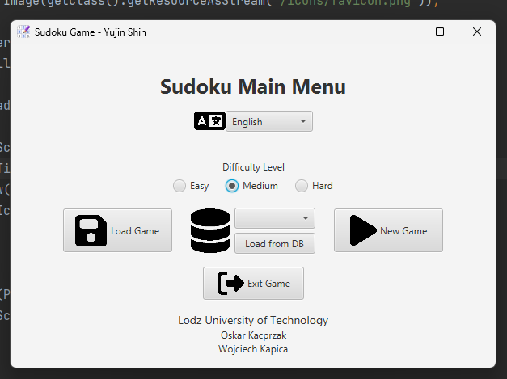

# Understanding the System

### What the Project Does
This project is a desktop-based Sudoku game application. It allows users to play Sudoku puzzles through a graphical user interface, where they can interact with a grid, input numbers, and attempt to solve the puzzle.

The application provides a structured environment for playing Sudoku rather than solving it manually, managing both the game state and user interactions.

 

### What Problem It Solves

The system solves the problem of managing a Sudoku game digitally. Instead of using paper, the application:

- Maintains the state of the puzzle (user inputs, correct/incorrect values)
- Provides a consistent interface for interacting with the board
- Stores Sudoku boards using a database (SQLite), allowing persistence

This reduces the complexity of tracking progress manually and ensures that the game logic is handled correctly by the system.

 

### Major Features

From exploring the system and running the application, the major features include:

- **Sudoku Board Display**   
A 9x9 grid where users can view and interact with the puzzle.
- **User Input Handling**   
Users can input numbers into cells to attempt solving the puzzle.
- **Game State Management**   
The system tracks the current state of the board, including which values have been entered.
- **Persistence (Database Integration)**  
Sudoku boards are stored using SQLite, allowing data to be retrieved and reused.
- **Validation Logic (Implicit)**  
The system likely includes logic to validate moves or maintain constraints of Sudoku (based on the presence of model and DAO layers).

 

### How a User Interacts with the System

A typical user interaction flow is as follows:

1. The user launches the application, which opens the Sudoku interface.
2. A Sudoku board is displayed on the screen.
3. The user interacts with the grid by selecting cells and entering numbers.
4. The system updates the board state in response to user input.
5. The user continues filling in values until the puzzle is complete.

The interaction is entirely GUI-based, meaning users do not need to interact with any underlying code or commands.

 

### Understanding from Code Structure

Based on the project structure (e.g., View, Model, Dao), the system appears to separate responsibilities:

- The View layer handles the user interface and user interactions
- The Model layer represents the Sudoku board and game state
- The DAO layer is responsible for database interactions (e.g., storing and retrieving boards)

This indicates that the application is not just a simple UI program, but a structured system with separation of concerns.

 

### Summary

In summary, this project is a GUI-based Sudoku application that allows users to interactively solve puzzles while the system manages game logic and persistence. The system combines user interface components, game state management, and database storage to provide a complete playable experience.

 

### Name-in-UI requirement:
<table>
  <tr>
    <td></td>
  </tr>
</table>

